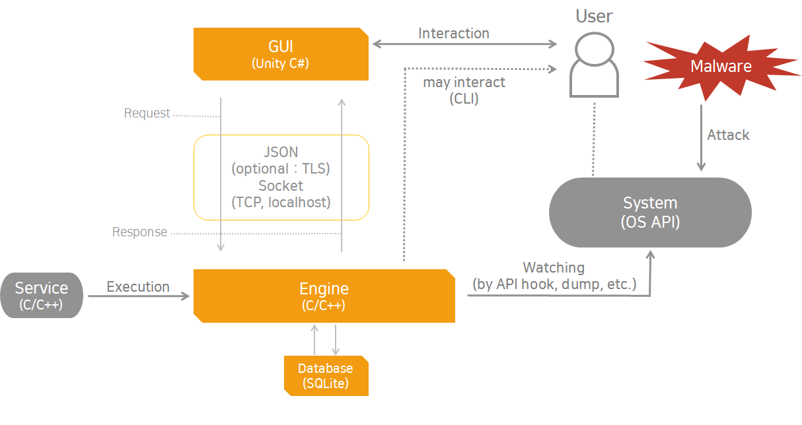

# System Architecture

TWTL Doc 006

TWTL 소프트웨어 시스템의 전체적 구조에 대해 기술합니다. 시스템을 이루는 각 요소들과 그 관계에 대해 소개하고, 각 요소에 대해서는 필요하다면 별도의 문서에서 기술하도록 합니다.

## Structure

## Speculation
자세한 사항은 [TWTL 005 overview](/005-overview) 참조하기 바랍니다.
 
- Service : Graphic User Interface 및 Engine 프로그램을 실행하며, 비정상 종료시 Alarm 및 재시작 기능을 수행합니다.

- Graphic User Interface : 실제 사용자가 접하는 부분으로, 사용자의 편의를 위한 여러가지 기능을 제공합니다.

- Engine : 부팅과 함께 자동으로 실행되고, 오류시 정상 동작을 유도합니다. System Monitering 과 Network Monitering으로 구성되어 있습니다. 

- Database : 엔진에서 캡쳐한 Register, Service 및 Packet을 저장하고, 필요시 엔진에서 접근합니다.

## 작업환경

* Engine : C/C++
* GUI : Unity