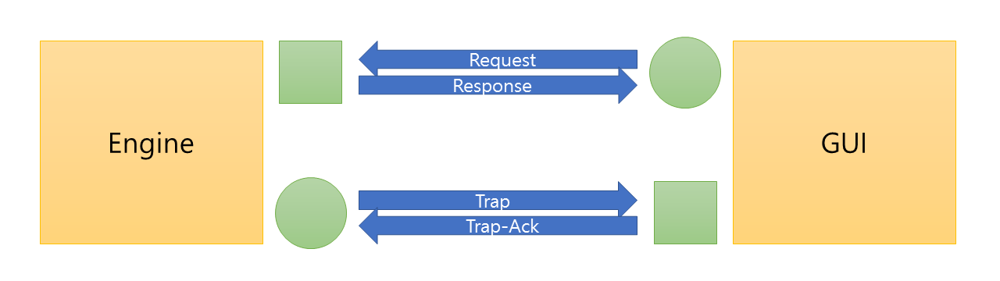

# Protocol

TWTL Doc 008

전체 구조에서 엔진-프로토콜 통신에 필요한 규약을 기술합니다.

## 개요

[TWTL Doc 006](/006-architecture)에서 다루었듯, TWTL 시스템의 핵심 기능은 Engine에서 담당하며, 사용자는 GUI를 통해 엔진의 동작을 제어하며 필요한 정보를 얻게 됩니다.

프로젝트의 타깃 플랫폼인 Win32 시스템에서 Engine과 GUI는 별도의 프로세스로 동작하도록 설계되었습니다. 따라서 둘 사이에 통신이 이루어질 방법이 필요하며, IP 스택 상에서 TCP/UDP 소켓 통신을 이용하는 것으로 정하였습니다.

이 문서에서 기술하는 프로토콜은 Engine과 GUI가 TCP/UDP 소켓을 이용할 방법에 대해 포괄적으로 다룹니다. 구체적인 내용으로는 연결의 의미론, 메시지의 구조, 연결 양단이 취해야 할 상태 등이 있습니다.

## 구조

### Request, Response

항상 실행 중인 상태를 취해야 하는 Engine은, 사용자가 임의로 껐다 켤 수 있어야 하는 GUI에 비해 안정적이어야 합니다. 이런 맥락과 플랫폼 안정성을 고려한 구조로, 주 채널은 Engine이 Listen하면 GUI가 Connect함으로써 성립합니다. Engine의 TCP Listen 포트 번호는 다음과 같습니다.

* 주 포트: 5259
* 보조 포트: 15259 (현재 사용하지 않음)

주 채널에서 Engine과 GUI의 연결은 일대일입니다. 이 채널에서 사용자가 GUI를 통해 얻어야 하는 대부분의 정보를 요청하고 또한 Engine에 특정한 동작을 하도록 명령을 내리게 됩니다. GUI가 먼저 메시지를 보내면, Engine은 받은 메시지에 대응하는 메시지로 응답합니다. GUI가 먼저 보내는 메시지를 Request, Engine이 나중에 보내는 메시지를 Response라 합니다.

각 메시지는 TCP를 통해 하나의 시퀀스로 전달되며, 시퀀스의 끝은 메시지의 끝을 의미합니다. Request와 Response는 각각 하나의 메시지입니다. 따라서 GUI가 보내는 Request 메시지를 담은 한 세그먼트 시퀀스가 끝나면, Engine은 그 메시지를 처리해 한 Response 메시지를 보내고 다시 Request 메시지를 받을 준비를 합니다. Engine은 먼저 연결을 끊어서는 안 됩니다.

Response는 Request보다 먼저 올 수 없습니다. Engine은 GUI의 Request 메시지를 기다립니다. 이 때문에 Engine이 GUI에 먼저 메시지를 보내야 할 경우를 대비해 Trap, Trap-Ack을 위한 채널이 필요하게 됩니다. 이에 대해서는 다음 문단으로 이어집니다.

### Trap, Trap-Ack

어떤 정보는 GUI가 Request하기 전에 사용자에게 즉시 전달될 필요가 있습니다. GUI에서 짧은 시간 간격으로 많은 정보를 Request함으로써 이를 극복할 수 있지만, TWTL 시스템의 주요 기능 중 하나가 네트워크 모니터링이라는 점에서 경우에 따라 이는 좋은 방법이 아닐 수 있습니다. push와 polling은 본질적으로 다른 의미론이기에 때에 맞게 이를 활용할 수 있는 것이 좋습니다.

Trap과 Trap-Ack은 이를 위한 메시지 타입입니다. Request/Response와는 달리, Trap/Trap-Ack을 위한 연결은 GUI가 활성일 경우 GUI가 먼저 임의의 Port를 정해 Listen을 하고, Engine이 여기에 Connect하는 방식으로 수립됩니다.

## 메시지 형식

## 시나리오

## 예시

### 예시: <init>

이 예시에서는 `<init>` 시나리오에서 GUI-Engine 사이에서 교환될 JSON 예시 메시지를 모두 나열했습니다.

이 구역의 본문은 [Example-init.md](./Example-init.md)입니다.
